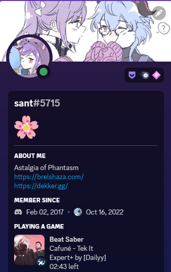
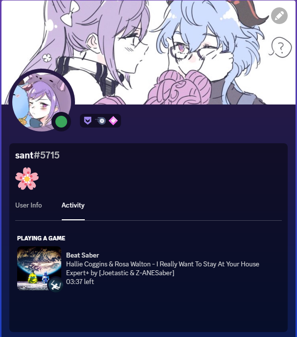

# bsrpc

Fork of <a href="https://github.com/DJDavid98/bsrpc">bsrpc (Beat Saber Rich Presence)</a> for Discord

TO DO:
- Config for the Rich Presence customization

    
    

## Dependencies

* BSIPA v4 (ModAssistant)
* DiscordCore (https://github.com/FizzyApple12/DiscordCore/releases/)
* DataPuller (https://github.com/ReadieFur/BSDataPuller/releases/)
* Websocket-Sharp (ModAssistant or https://github.com/sta/websocket-sharp)
